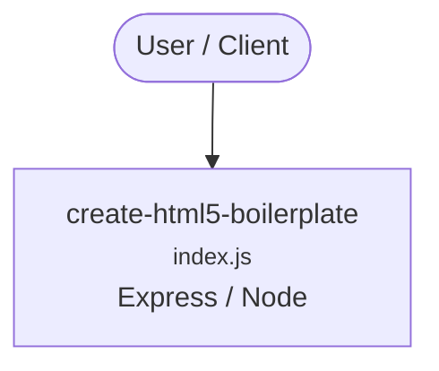

# Context Map — `create-html5-boilerplate`

> Auto-generated architecture & deployment context map. Summarizes the core application, container/cloud footprint, and database connections. Regenerate after significant structural changes.

**Repo:** `avnit/create-html5-boilerplate` · **Fork** · Public · Primary language: JavaScript · Default branch: `main` · Files: 27

**Description:** npx quick start for html5-boilerplate

## 1. Core application

Create HTML5 Boilerplate

- **Frameworks / runtime:** Express / Node
- **Entry points:** `index.js`
- **Listens on port(s):** 25

## 2. Containers & cloud applications

_No container, Kubernetes, IaC, or cloud-deploy manifests detected. Runs as a local script/library or static site._

## 3. Database connections

_No database drivers or connection strings detected._

## 4. Architecture diagram

## 5. Security posture

- **Dependabot alerts (open):** 1 critical, 32 high, 17 medium, 6 low

---
_Generated by repo context-mapping pass on 2026-08-13._